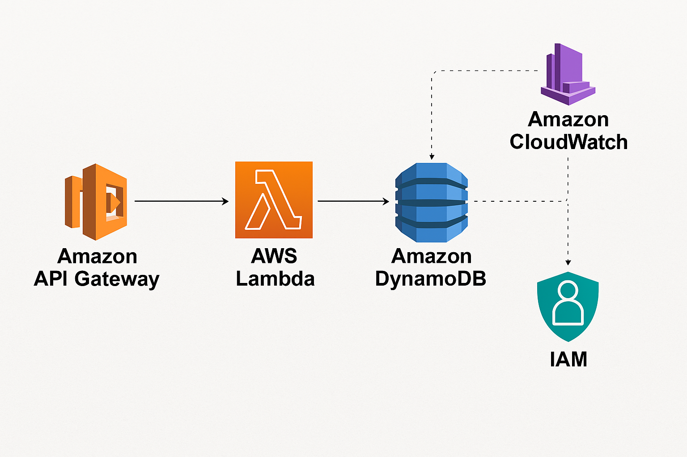

# 📋 Serverless To-Do API with AWS Lambda, API Gateway & DynamoDB


A fully serverless backend for managing To-Do tasks using AWS Lambda, API Gateway, and DynamoDB. This project provides secure, scalable RESTful API endpoints to create, retrieve, and delete tasks — all tested via Postman.

---
## 📚 Table of Contents

- [Features](#-features)
- [Architecture Diagram](#️-architecture-diagram)
- [Technologies Used](#-technologies-used)
- [IAM Role Permissions](#-iam-role-permissions)
- [API Endpoints](#-api-endpoints)
- [DynamoDB Schema](#-dynamodb-schema)
- [Project Structure](#-project-structure)
- [Postman Testing](#-postman-testing)
- [Getting Started](#-getting-started)
- [Future Improvements](#-future-improvements)
- [Author](#-author)
- [License](#-license)

## 📌 Features

- ✅ **Serverless architecture** (no EC2 or manual scaling)
- 📦 **Task management using DynamoDB**
- 🧠 **Unique taskId per task** using Lambda request ID
- 🌐 **RESTful API endpoints** via API Gateway
- 🔐 **IAM roles and CORS configuration** for security
- 🧪 **Tested using Postman**
- 🗂️ **Includes architecture diagram and organized folder structure**

---

## 🖼️ Architecture Diagram



---

## 🚀 Technologies Used

- [AWS Lambda](https://aws.amazon.com/lambda/) – Serverless compute  
- [Amazon API Gateway](https://aws.amazon.com/api-gateway/) – RESTful API exposure  
- [Amazon DynamoDB](https://aws.amazon.com/dynamodb/) – NoSQL database  
- [IAM Roles & Policies](https://docs.aws.amazon.com/IAM/latest/UserGuide/access_policies.html) – Secure Lambda-DynamoDB integration  
- [Postman](https://www.postman.com/) – API testing 

---
📜 IAM Role Permissions
To enable secure access between your Lambda functions and the DynamoDB table, the following IAM role permissions are defined in the serverless.yml:

yaml
Copy
Edit
provider:
  iamRoleStatements:
    - Effect: Allow
      Action:
        - dynamodb:PutItem
        - dynamodb:GetItem
        - dynamodb:Scan
        - dynamodb:DeleteItem
      Resource:
        - arn:aws:dynamodb:${opt:region, self:provider.region}:*:table/ToDoTable
🛡️ This grants each Lambda function the minimum required permissions to:

Create new tasks (PutItem)

Retrieve all tasks (Scan)

Fetch a single task (GetItem)

Delete a task (DeleteItem)

🔒 Always follow the principle of least privilege when granting AWS permissions.

---

## 🛠️ API Endpoints

| Method | Endpoint | Description         |
|--------|----------|---------------------|
| GET    | /tasks   | Get all tasks       |
| POST   | /tasks   | Create a new task   |
| DELETE | /tasks   | Delete task by ID   |

🔄 All endpoints are routed via **API Gateway** and handled by **individual Lambda functions**.

---

## 📦 DynamoDB Schema

| Field     | Type    | Description                      |
|-----------|---------|----------------------------------|
| taskId    | String  | Primary key (Partition key)      |
| name      | String  | Name of the task                 |
| completed | Boolean | Task status (`true` / `false`)   |

---

## 📁 Project Structure

```bash
serverless-todo-api/
├── assets/                 # Architecture diagram
│   └── architecture-diagram.png
├── lambda/                 # Lambda function code
│   └── handler.py
├── .gitignore
├── LICENSE
└── README.md
```

## 🧪 Postman Testing

Postman was used to test all endpoints with appropriate headers and JSON bodies.

```http
# ✅ Create Task (POST)
POST /tasks
Content-Type: application/json

{
  "name": "Finish documentation",
  "completed": false
}

# 📥 Get All Tasks (GET)
GET /tasks

# 🗑️ Delete Task (DELETE)
DELETE /tasks
Content-Type: application/json

{
  "id": "example-task-id"
}
```
## 📌 Getting Started

- Clone the repository:
    ```bash
    git clone https://github.com/Cloud-Architect-Emma/serverless-todo-api.git
    cd serverless-todo-api
    ```
- Deploy your Lambda functions and set up API Gateway using the **Serverless Framework**:
    ```bash
    serverless deploy
    ```
- Alternatively, you can manually deploy via the AWS Console or use **AWS SAM** for deployment.
- Create a DynamoDB table named `ToDoTable` with `taskId` as the Partition Key. (Refer to the DynamoDB section above for more details.)
- Test the endpoints using **Postman** or any REST client.


---

## ✅ Future Improvements

- Add unit tests with `pytest`  
- Add user authentication with Cognito  
- Add pagination to `GET /tasks`  
- Add CloudFormation or Terraform support


---

## 👨‍💻 Author
Built with ❤️ by **Cloud-Architect-Emma**


---

## 📜 License
This project is licensed under the **MIT License**.
