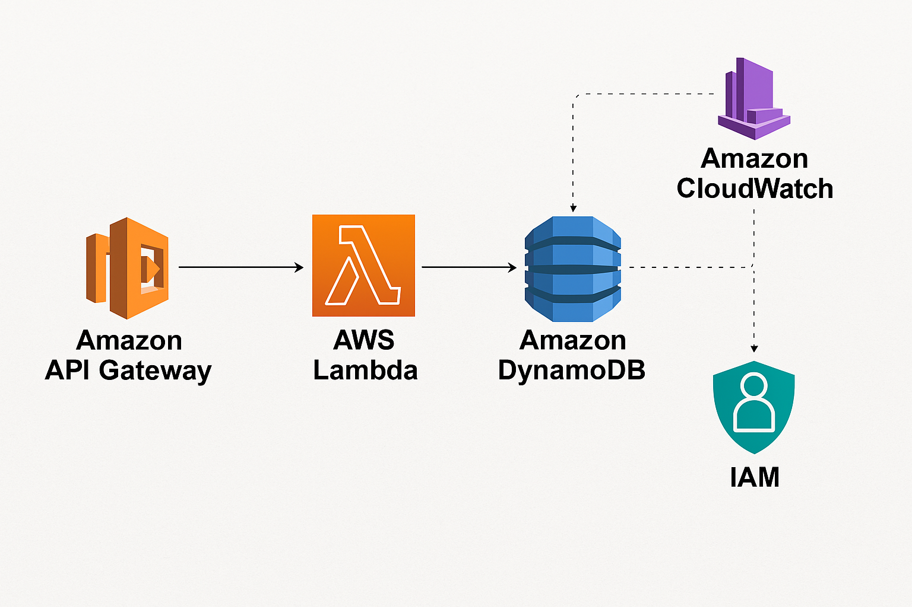

# 📋 Serverless To-Do API with AWS Lambda, API Gateway & DynamoDB


A fully serverless backend for managing To-Do tasks using AWS Lambda, API Gateway, and DynamoDB. This project provides secure, scalable RESTful API endpoints to create, retrieve, and delete tasks — all tested via Postman.

---

## 📌 Features

- ✅ **Serverless architecture** (no EC2 or manual scaling)
- 📦 **Task management using DynamoDB**
- 🧠 **Unique taskId per task** using Lambda request ID
- 🌐 **RESTful API endpoints** via API Gateway
- 🔐 **IAM roles and CORS configuration** for security
- 🧪 **Tested using Postman**
- 🗂️ **Includes architecture diagram and organized folder structure**

---

## 🖼️ Architecture Diagram



---

## 🚀 Technologies Used

- **AWS Lambda** – Serverless compute
- **Amazon API Gateway** – RESTful API exposure
- **Amazon DynamoDB** – NoSQL database
- **IAM Roles & Policies** – Secure Lambda-DynamoDB integration
- **Postman** – API testing

---

## 🛠️ API Endpoints

| Method | Endpoint | Description         |
|--------|----------|---------------------|
| GET    | /tasks   | Get all tasks       |
| POST   | /tasks   | Create a new task   |
| DELETE | /tasks   | Delete task by ID   |

🔄 All endpoints are routed via **API Gateway** and handled by **individual Lambda functions**.

---

## 📦 DynamoDB Schema

| Field     | Type    | Description                      |
|-----------|---------|----------------------------------|
| taskId    | String  | Primary key (Partition key)      |
| name      | String  | Name of the task                 |
| completed | Boolean | Task status (`true` / `false`)   |

---

## 📁 Project Structure

```bash
serverless-todo-api/
├── assets/                 # Architecture diagram
│   └── architecture-diagram.png
├── lambda/                 # Lambda function code
│   └── handler.py
├── .gitignore
├── LICENSE
└── README.md
🧪 Postman Testing
Postman was used to test all endpoints with appropriate headers and JSON bodies.

✅ Create Task (POST)
http
Copy
Edit
POST /tasks
Content-Type: application/json
json
Copy
Edit
{
  "name": "Finish documentation",
  "completed": false
}
📥 Get All Tasks (GET)
http
Copy
Edit
GET /tasks
🗑️ Delete Task (DELETE)
http
Copy
Edit
DELETE /tasks
Content-Type: application/json
json
Copy
Edit
{
  "id": "example-task-id"
}
📌 Getting Started
Clone the repository

Deploy your Lambda functions and set up API Gateway via AWS Console or AWS SAM

Create a DynamoDB table named ToDoTable with taskId as the Partition Key

Test endpoints using Postman or any REST client

✅ Future Improvements
Add unit tests with pytest

Add user authentication with Cognito

Add pagination to GET /tasks

Add CloudFormation or Terraform support

👨‍💻 Author
Built with ❤️ by Cloud-Architect-Emma

📜 License
This project is licensed under the MIT License.
